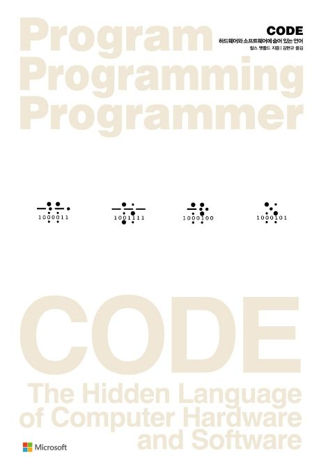

# CODE: 하드웨어와 소프트웨어에 숨어 있는 언어

## 학습 목적

_따라서 어떤 기술의 과거 형태를 살펴보면 오늘날의 기술과 기본적으로 같으며 좀 더 간단한 형태를 가지고 있기 때문에, 많은 측면에서 좀 더 편하게 기술을 파악할 수 있다는 장점이 있습니다. 이것이 바로 기술에 대한 역사를 공부하는 의의라 할 수 있겠습니다._

공부를 할 수록 근본적인 부분에 대한 의문이 항상 생겼다. 파이썬 언어를 주로 공부하던 내 입장에서는 자바와 코틀린에서 존재하는 네임 맹글링(Name Mangling) 등이 낯설었다. 또한 정적 자료형 언어와 달리 동적 자료형 언어인 파이썬의 경우 정수형(Integer)은 거의 정해진 크기에 제한이 존재하지 않는다. 이런 부분은 특히 이분 탐색(Binary Search)을 구현할 때 중간값(`middle`)을 정의하는 방법에서 차이가 나기도 하는데 예를 들면 시작값과 끝값을 더하는 과정에서 오버플로(Overflow) 예외사항을 발생하지 않게 하기 위해 정적 자료형 언어에서는 끝값과 시작값을 먼저 뺀 뒤에 시작값을 더하는 방식으로 진행된다. 이외에도 파이썬의 내부적인 작동 방식에 대해 궁금증이 많았는데 기본적으로 이를 이해하기 위해서는 컴퓨터 자체에 대한 이해가 우선적이라는 생각이 들었다.

사실 이런 이유 외에도 개인적인 호기심으로 하드웨어를 잘 알고 싶어졌다. 시스템 프로그래밍을 해보고 싶은 욕심이 생겼기 때문이다. 어쨌든 알아둬서 나쁠 건 없으니까! 컴퓨터와 더 친해지길 바라며 더불어 호기심이 확장되어 수학과 물리도 공부하게 되는 계기가 마련되면 좋겠다.

## 학습 내용

<table>
    <th> 
        <td> 제목 </td>
        <td> 일자 </td>
    </th>
    <tr>
        <td> <a href="./01/README.md"> Chapter 1. 친한 친구와의 대화 </a> </td>
        <td> 2022. 10. 01 </td>
    </tr>
    <tr>
        <td> <a href="./02/README.md"> Chapter 2. 부호와 조합 </a> </td>
        <td> 2022. 10. 01 </td>
    </tr>
    <tr>
        <td> <a href="./03/README.md"> Chapter 3. 점자와 이진 부호 </a> </td>
        <td> 2022. 10. 02 </td>
    </tr>
    <tr>
        <td> <a href=""> Chapter 4. 전등을 분해해 봅시다 </a> </td>
        <td>  </td>
    </tr>
    <tr>
        <td> <a href=""> Chapter 5. 다른 방법을 ㅊ팢아봅시다 </a> </td>
        <td>  </td>
    </tr>
    <tr>
        <td> <a href=""> Chapter 6. 전신과 릴레이 </a> </td>
        <td>  </td>
    </tr>
    <tr>
        <td> <a href=""> Chapter 7. 우리가 사용하는 열 개의 숫자들 </a> </td>
        <td>  </td>
    </tr>
    <tr>
        <td> <a href=""> Chapter 8. 십진수 이외의 것 </a> </td>
        <td>  </td>
    </tr>
    <tr>
        <td> <a href=""> Chapter 9. 비트, 비트, 비트 </a> </td>
        <td>  </td>
    </tr>
    <tr>
        <td> <a href=""> Chapter 10. 논리와 스위치 </a> </td>
        <td>  </td>
    </tr>
    <tr>
        <td> <a href=""> Chapter 11. 빌 게이츠? 논리 게이트! </a> </td>
        <td>  </td>
    </tr>
    <tr>
        <td> <a href=""> Chapter 12. 이진 덧셈기 </a> </td>
        <td>  </td>
    </tr>
    <tr>
        <td> <a href=""> Chapter 13. 그렇다면 뺄셈은 어떨까요? </a> </td>
        <td>  </td>
    </tr>
    <tr>
        <td> <a href=""> Chapter 14. 피드백과 플립플롭 </a> </td>
        <td>  </td>
    </tr>
    <tr>
        <td> <a href=""> Chapter 15. 바이트와 16진수 </a> </td>
        <td>  </td>
    </tr>
    <tr>
        <td> <a href=""> Chapter 16. 메모리를 만들어 봅시다 </a> </td>
        <td>  </td>
    </tr>
    <tr>
        <td> <a href=""> Chapter 11. 빌 게이츠? 논리 게이트! </a> </td>
        <td>  </td>
    </tr>
    <tr>
        <td> <a href=""> Chapter 17. 혼자서 움직이는 컴퓨터 </a> </td>
        <td>  </td>
    </tr>
    <tr>
        <td> <a href=""> Chapter 18. 주판에서 반도체까지 </a> </td>
        <td>  </td>
    </tr>
       <tr>
        <td> <a href=""> Chapter 19. 두 가지 고전적인 마이크로프로세서들 </a> </td>
        <td>  </td>
    </tr>
    <tr>
        <td> <a href=""> Chapter 20. 아스키 코드와 문자의 변환 </a> </td>
        <td>  </td>
    </tr>
    <tr>
        <td> <a href=""> Chapter 21. 버스에 올라탑시다 </a> </td>
        <td>  </td>
    </tr>
    <tr>
        <td> <a href=""> Chapter 22. 운영체제 </a> </td>
        <td>  </td>
    </tr>
    <tr>
        <td> <a href=""> Chapter 23. 고정소수점과 부동소수점 </a> </td>
        <td>  </td>
    </tr>
    <tr>
        <td> <a href=""> Chapter 24. 고수준 언어와 저수준 언어 </a> </td>
        <td>  </td>
    </tr>
    <tr>
        <td> <a href=""> Chapter 25. 그래픽 혁명 </a> </td>
        <td>  </td>
    </tr>

</table>
